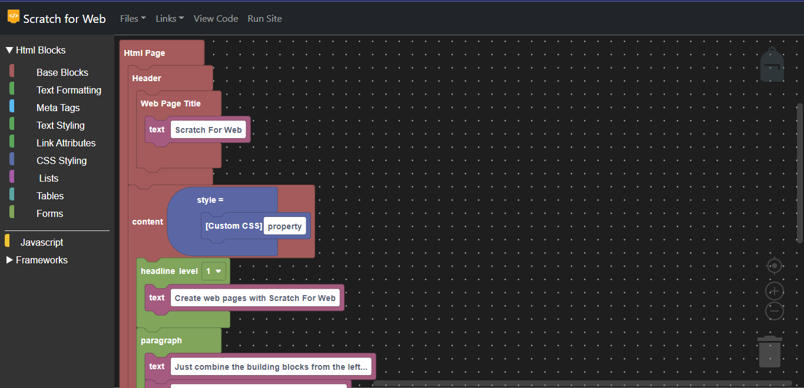

# Scratch For Web
Scratch For Web - Create Dynamic Responsive Webpages fast using blocks!

## Links

Website: https://scratch4web.vercel.app/

Discord: https://discord.gg/57HNMGDvXa

# Contributions
 * Please follow current code syntax.
 * Be sure to make pull requests and comment whats changed
 * Supply both unminified and minified versions  - minfied if approved will be used in production! 
  - minify tool that we use: https://minify-js.com/ 
 

